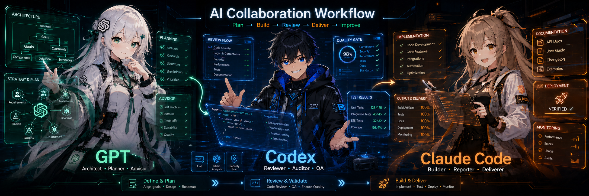

<p align="center">
  
</p>

<p align="center">
  <h1 align="center">threetwoa-cc-workshop</h1>
  <p align="center"><strong>AI Workflow Operating System — Claude Code 配置工坊 &amp; 知识资产库</strong></p>
</p>

<p align="center">
  
  
  
  
  
</p>

<p align="center">
  <a href="#-highlights">Highlights</a> · <a href="#-origin">Origin</a> · <a href="#-repo-structure">Structure</a> · <a href="#gear-workflow">Workflow</a> · <a href="#-progress">Progress</a> · <a href="#-quick-start">Quick Start</a> · <a href="#link-links">Links</a>
</p>

---

## ✨ Highlights

- **生熟分离** — `reports/raw/` 保留原始调研，`docs/` 只放提炼后的长期知识，边界明确
- **三层工作流** — GPT(brain) → Claude Code(execute) → Codex(review)，各取所长
- **.claude 生态** — 3 Agents + 3 Commands + 3 Rules + 2 Skills，Cargo-cult free，全是实打实的可执行配置
- **HeroUI Pro 全覆盖** — 55 组件 API 参考 + 移植指南 + 模板架构 + Dashboard 骨架模板
- **UI Workflow 系统** — 7 篇提炼文档 + 4 个项目模板，从选型到落地一站搞定
- **安全基线** — no-secrets rule 扫描 11 种密钥模式，杜绝凭证入仓

## 🌱 Origin

这个仓库源于一个痛点：Claude Code 的配置、调研报告和项目模板散落在各处，每次新会话都要重新找、重新理解。

于是用两轮 Agent 协作完成了重组：

- **Round 1**：仓库结构重组，9 目录架构，9 篇 docs 提炼，.claude/ 骨架搭建
- **Round 2**：骨架填充（agents/commands/rules 从 40 行扩到 120-229 行），HeroUI + UI Workflow 文档提炼，registry JSON 索引，template 体系，Git init

核心理念：**AI 编程不是写代码，是配置一个能持续运作的系统**。这个仓库就是那个系统。

## 📂 Repo-Structure

```
threetwoa-cc-workshop/
├── .claude/                        # Claude Code 运行时配置
│   ├── CLAUDE.md                   #   Agent 人格（Hermes 风格）
│   ├── agents/                     #   3 Agents（cartographer / distiller / orchestrator）
│   ├── commands/                   #   3 Commands（/distill-report / /restructure-repo / /update-registry）
│   ├── rules/                      #   3 Rules（research-reporting / file-organization / no-secrets）
│   └── skills/                     #   2 Skills（repo-manager / report-distiller）
├── docs/                           # 提炼后的长期知识
│   ├── claude-code/                #   6 篇 — 全功能谱系、Skills 清单、三层工作流等
│   ├── heroui/                     #   3 篇 — 组件参考、移植指南、模板架构
│   └── ui-workflow/                #   7 篇 — 工作流标准、反模式、组合配方等
├── reports/raw/                    # 原始调研报告（只增不改）
├── templates/                      # 可复制项目模板
│   ├── heroui/dashboard-starter/   #   HeroUI Dashboard 11 文件骨架
│   └── ui-workflow/                #   PRODUCT.md / CLAUDE.md / DESIGN.md 模板
├── registry/                       # 资产索引（JSON + MD）
├── archive/                        # 历史归档
├── reorg/                          # 重组规划记录（过程文档）
├── 00-START-HERE.md                # 首次访问入口
├── archive/                         # 历史归档
│   └── 2026-05-30/                  #   包含 HANDOFF-Round2.md 等历史文件
└── README.md
```

<details>
<summary>📊 完整文件清单（88 文件）</summary>

```
.claude/
  CLAUDE.md, README.md, settings.example.json
  agents/repo-cartographer.md (151 行)
  agents/report-distiller.md (135 行)
  agents/workflow-orchestrator.md (196 行)
  commands/distill-report.md (~130 行)
  commands/restructure-repo.md (~140 行)
  commands/update-registry.md (~120 行)
  rules/file-organization.md (147 行)
  rules/no-secrets.md (229 行)
  rules/research-reporting.md (193 行)
  skills/my-claude-repo-manager/SKILL.md (101 行)
  skills/report-to-doc-distiller/SKILL.md (116 行)

docs/
  INDEX.md
  claude-code/feature-handbook.md, skills-inventory.md, diagram-skills-reference.md,
  codegraph-gitnexus-guide.md, claude-mem-guide.md, tri-layer-workflow.md
  heroui/component-reference.md (316 行), porting-guide.md (463 行),
  template-architecture.md (536 行)
  ui-workflow/workflow-standard.md, tool-routing-cheatsheet.md, gsap-motion-guide.md,
  anti-pattern-cookbook.md, skill-combination-recipes.md,
  diagram-tool-selection-guide.md, windows-skill-gap-workaround.md

registry/
  index.json, tags.json, assets.json, asset-index.md, decision-log.md,
  skill-registry.md, workflow-registry.md
  manifests/skills-manifest.json, commands-manifest.json

templates/
  heroui/dashboard-starter/ (11 文件: README, package.json, src/...)
  heroui/porting-checklist.md
  ui-workflow/project-PRODUCT.md, project-CLAUDE.md, project-DESIGN.md, gsap-checklist.md

reorg/ (00-09 共 10 文件)
reports/raw/ (heroui ×2, ui-workflow ×2)
archive/2026-05-30/ (13 文件)
```

</details>

## ⚙️ Workflow

三层模型，各司其职：

```
┌─────────┐    spec/prompt    ┌──────────────┐    review/反驳    ┌─────────┐
│   GPT   │ ────────────────▶ │ Claude Code  │ ────────────────▶ │  Codex  │
│ (Brain) │                   │  (Execute)   │                   │ (Audit) │
└─────────┘                   └──────────────┘                   └─────────┘
                                    │
                              ┌──────┴──────┐
                              │  .claude/   │
                              │ agents ─────┤
                              │ commands ───┤
                              │ rules ──────┤
                              │ skills ─────┘
                              └─────────────┘
```

- **GPT (Brain)**：高层决策、spec 编写、prompt 设计、综合分析
- **Claude Code (Execute)**：本地执行、代码实现、文件操作、.claude/ 维护
- **Codex (Audit)**：审查、反驳、风险评估、质量守门

详见 [`docs/claude-code/tri-layer-workflow.md`](docs/claude-code/tri-layer-workflow.md)

### 知识生命周期

```
reports/raw/ ──提炼──▶ docs/ ──索引──▶ registry/
   (只增不改)        (长期知识)      (可检索)
```

- **raw/** 保留原始调研的完整性，不二次编辑
- **docs/** 提炼后的知识，必须包含 frontmatter（title / type / status / source_files / updated / owner）和 `## Source Material` 章节
- **registry/** JSON + MD 双格式索引，保持同步

## 📊 Progress

| Phase | 内容 | 状态 |
|-------|------|:----:|
| P0 | HeroUI 2 篇核心文档提炼 | ✅ |
| P0 | .claude/ 生态填充（3+3+3 = 9 配置） | ✅ |
| P1 | 4 篇 UI Workflow 文档 + 2 Skills | ✅ |
| P1 | Registry JSON 索引 + Source Material 补全 | ✅ |
| P1 | 三层工作流文档 | ✅ |
| P2 | Dashboard Starter 模板 + 项目模板 | ✅ |
| P3 | Verification Report + Git init + Handoff | ✅ |

## 🚀 Quick Start

1. **Clone**
   ```bash
   git clone https://github.com/Aafff623/threetwoa-cc-workshop.git
   cd threetwoa-cc-workshop
   ```

2. **Read the entrance**
   ```bash
   # 首次访问必读
   cat 00-START-HERE.md
   ```

3. **Browse the index**
   ```bash
   # 全局文档索引
   cat docs/INDEX.md
   ```

4. **Use a template**
   ```bash
   # 复制 HeroUI Dashboard 骨架到新项目
   cp -r templates/heroui/dashboard-starter/ my-new-project/
   ```

5. **Adopt .claude config**（可选）
   ```bash
   # 将 agents/commands/rules/skills 复制到你项目的 .claude/ 目录
   cp -r .claude/agents /path/to/your/project/.claude/agents
   cp -r .claude/commands /path/to/your/project/.claude/commands
   cp -r .claude/rules /path/to/your/project/.claude/rules
   cp -r .claude/skills /path/to/your/project/.claude/skills
   ```

## 💡 Judge

几条这个仓库遵循的设计判断：

- **绝不删除文件** — 只移动、归档、提炼，保护每一条知识资产
- **生熟分离** — `reports/raw/` 和 `docs/` 边界不可逾越
- **.claude/ 只放可执行配置** — 不当文档垃圾桶，Cargo-cult free
- **frontmatter 必须** — 每个 doc 都有 title / type / status / source_files，保证可追溯
- **no-secrets 不可绕过** — 11 种密钥模式扫描，发现了就阻断

## 🔗 Links

| 资源 | 说明 |
|------|------|
| [00-START-HERE.md](00-START-HERE.md) | 首次访问入口 |
| [docs/INDEX.md](docs/INDEX.md) | 全局文档索引 |
| [HANDOFF-Round2.md](archive/2026-05-30/HANDOFF-Round2.md) | Round 2 会话交接文档 |
| [.claude/CLAUDE.md](.claude/CLAUDE.md) | Agent 人格配置 |
| [HeroUI 组件参考](docs/heroui/component-reference.md) | 55 组件 API + 已验证代码 |
| [UI Workflow 标准](docs/ui-workflow/workflow-standard.md) | 完整工作流规范 |

## 🔒 Privacy

- **无真实密钥** — 所有 `HEROUI_KEY`、API key、token 均为占位符（`hp_xxxx`、`${env:VAR}`）
- **no-secrets rule** — 11 种密钥模式扫描，阻断写入
- **settings.example.json** — 仅含示例配置，无凭证
- **.gitignore** — 排除 `.env`、`node_modules/`、`Thumbs.db`

---

*Last updated: 2026-05-30*